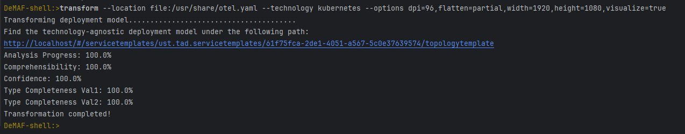
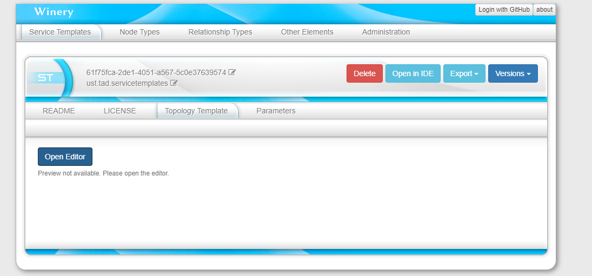
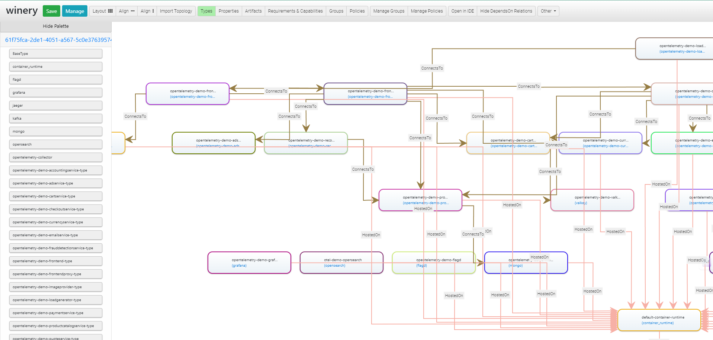

# EnPro-Documentation
Documentations and artifacts of the EnPro University Stuttgart summer semester 2024.  
Within this document you can find a general instruction on how the project is build and used.  
For a guide to MPS testing see [this file](mps-testing/README.md).  
For a guide on how to use the GitHub container registry (ghcr) and how to setup the GitHub Actions correctly see [this file](ghcr/README.md).

---
# DeMAF Documentation

DeMAF is organized in one big GITHUB Project (https://github.com/UST-DeMAF) with several (Sub-) Repositories. 
Most of the repositories are *“Plugin”* repositories which represent functions of the tool for a specific deployment technology.


DeMAF is organized in a microservice architecture. To run the tool you need to run every microservice as well as the databases. For easy use, we recommend deployment on your local machine with `docker-compose` and the [deployment-config repository](https://github.com/UST-DeMAF/deployment-config/tree/main) which starts all necessary services and all available plugins.

---

# Getting Started:
1. To deploy the DeMAF Tool with `docker-compose`, it is required to install Docker and Docker Compose (https://docs.docker.com/compose/install/). Install depending on your OS Docker Desktop, as describe on the website.

2. Clone the Deployment Config Tool (https://github.com/UST-DeMAF/deployment-config.git) 
    -	`git clone https://github.com/UST-DeMAF/deployment-config.git`

3. Make sure, the Docker Desktop Application is running.

4. Go to the root directory of the `deployment-config` repository on your system and run `docker-compose pull && docker-compose up -d` on your system.
    - The console output looks like this:
      

    - Inside the docker-application you also see, that the containers are running:
      

5.	Clone the DeMAF-Shell to your system (as a independent repository):
    - `git clone https://github.com/UST-DeMAF/demaf-shell.git`

6.	Open a CMD and navigate to the `demaf-shell` root folder and run the command: 
    - Windows: `mvnw spring-boot:run`
    - Mac and Linux: `./mvnw spring-boot:run`

    - The DeMAF-shell boots up:
      
 
7.	Inside the DeMAF-shell you can run the following commands:
    - `transform`: transforms a deployment model into an EDMM Model
      - **arguments**: 
        - `location` (short: `l`): location of the deployment model
            -  The location argument is mandatory for the transformation process.
            -  It needs to point to the volume folder of your cloned deployment-config repository (E.g. file:/usr/share).
            -  After the location argument you need to specify that you search for a file. Use file: for this.
        - `technology` (short: `t`): deployment technology used (depends on available plugins `[bash, terraform, ...]`)
            -  The technology argument is mandatory for the transformation process.
        - `commands` (short: `c`): specify how the deployment model is executed (e.g., for Terraform, you can pass parameters for the execution plan)
            - The commands argument is optional and not mandatory for the transformation process.
        - `options` (short: `o`):  the optionsargument is currently used for the visualisation service.
            - Flags which can be provided in the options argument:
              - visualize=true/false (default: false)
              - height=pixel (default: 1080 pixels)
              - width=pixel (default: 1920 pixels)
              - flatten=true/false/partial (default: false)
              - dpi=dots per inch of your monitor (default: 96 dpi)
            - Example: --options dpi=96,flatten=true,width=1920,height=1080,visualize=true
            - The options argument is optional and not mandatory for the transformation process. 
    - `plugins`: List all (available) registered plugins
    - `purge`: you can purge all plugin queues, which removes open or pending transformations (example: purge 1 (removes the first queue of the list), purge terraformSTATIC (purges the terraform Queue)).
    - `listq`: Lists all available RaabitMQ queues (Queues of the plugins which can be purged)
    - `help`: Shows all available commands for the Demaf-Shell
## Examples:
* **Example I**:
    * We built example deployments for various deployment technologies in the [opentelemetry-demo repository](https://github.com/UST-DeMAF/opentelemetry-demo/tree/demaf).
    * For this example we will use the Kubernetes yaml-file. Download the [yaml-file](https://github.com/UST-DeMAF/opentelemetry-demo/blob/demaf/kubernetes/opentelemetry-demo.yaml) and store it in the volume folder of your deployment-config repository..
    * Start the DeMAF Application as well as the DeMAF Shell, explained in Step 1-6.
    * Run inside the DeMAF-Shell: ```transform --location file:/usr/share/opentelemetry-demo.yaml --technology kubernetes --options visualize=false```
    * Expected Result:
      
    * The result file can be found in the project folder `/deployment-config/volume/tadms`
    
 * **Example II**:
     * This example shows how to use the visualization service after the transformation process.
     * For this example we will use the Kubernetes yaml-file. Download the [yaml-file](https://github.com/UST-DeMAF/opentelemetry-demo/blob/demaf/kubernetes/opentelemetry-demo.yaml) and store it in the volume folder of your deployment-config repository.
     * Start the DeMAF Application as well as the DeMAF Shell, explained in Step 1-6.
     * Run inside the DeMAF-Shell: ```transform --location file:/usr/share/opentelemetry-demo.yaml --technology kubernetes --options dpi=96,flatten=true,width=1920,height=1080,visualize=true```
     * 
     * Expected Results:
        * When using visualize=true the DeMAF Shell outputs a link to the Visualization in Winery:
             * 
        * Copy this link in a browser (or click on it if the hosting shell supports it) and you will see Winery:
             * 
        * Click on _Open Editor_ and the graph will be visible:
            * 

* **Example III**:
    * Clone the Example Deployment Model: `git clone https://github.com/Well5a/kube`
    * Run: ```transform --location file:/usr/share/kube/azure-start.sh --technology bash --commands ./azure-start.sh``` inside the DeMAF-shell
      
---
## Help Section
If you encounter problems during installation and initial use, the following points may help you:

1. If you try to run `docker pull && docker-compose up -d` command and you receive the following error:
  ```log
  C:\Users\USER\deployment-config>docker-compose pull && docker-compose up -d time="2024-05-24T12:12:57+02:00" level=warning msg="C:\\Users\\USER\\deployment-config\\docker-compose.yml: `version` is obsolete" unable to get image 'well5a/kubernetes-mps-plugin:latest': error during connect: this error may indicate that the docker daemon is not running: Get "http://%2F%2F.%2Fpipe%2Fdocker_engine/v1.45/images/well5a/kubernetes-mps-plugin:latest/json": open //./pipe/docker_engine: The system cannot find the specified file
  ```
  - **Make sure the Docker-Application is running**


