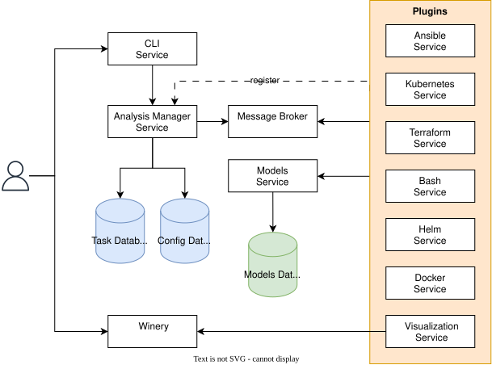
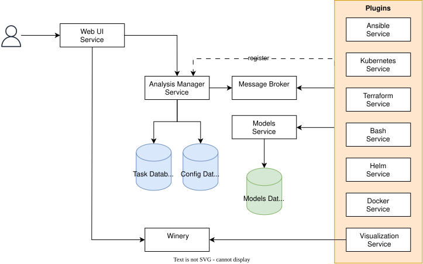

# Architecture

The following figure overviews the architecture of the DeMAF:

Each component is an independent self-contained microservice.
The DeMAF follows a plugin-based approach: Each **plugin** is responsible for transforming a deployment model created with a specific deployment technology.

- [**CLI Service**](<https://github.com/UST-DeMAF/demaf-shell>): Provides a command line interface for users to start a new transformation process.
- [**Analysis Manager Service**](<https://github.com/UST-DeMAF/analysis-manager>): Manages the transformation process by creating and distributing transformation tasks to the plugins. Plugins register at startup at the Analysis Manager Service.
- **Config Database**: PostgreSQL database for storing information about registered plugins.
- **Task Database**: PostgreSQL database for storing and keeping track of transformation tasks.
- **Message Broker** RabbitMQ Message Broker for asynchronous communication between the Analysis Manager Service and the plugins.
- [**Models Service**](<https://github.com/UST-DeMAF/models-service>): Provides common interface for plugins for storing and updating EDMM models.
- **Models Database**: MongoDB database for storing EDMM models.
- [**Visualization Service**](<https://github.com/UST-DeMAF/visualization-service>): Processes the EDMM models and sends them to the external [**Winery**](<https://github.com/winery/winery>) tool, which can be accessed by the user for visualization of the EDMM models.

As an alternative to the CLI Service, we now also provide the [**Web UI Service**](<https://github.com/UST-DeMAF/web-ui>) for starting the transformation process viewing the resulting EDMM models by embedding the Winery tool:

Currently Supported Plugins:

- [Ansible](<https://github.com/UST-DeMAF/ansible-mps-plugin>)
- [Kubernetes](<https://github.com/UST-DeMAF/kubernetes-mps-plugin>)
- [Terraform](<https://github.com/UST-DeMAF/terraform-mps-plugin>)
- [Bash](<https://github.com/UST-DeMAF/bash-plugin>)
- [Helm](<https://github.com/UST-DeMAF/helm-plugin>)
- [Docker](<https://github.com/UST-DeMAF/docker-plugin>)

## Further Reading

For more details on the transformation process and how each plugin handles the transformation, refer to the [Transformation Documentation](../transformations/README.md).

The [Getting Started Guide](../gettingStarted/README.md) explains how to deploy and use the DeMAF.
