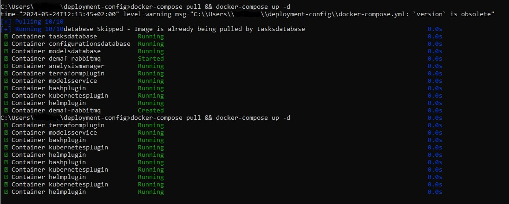
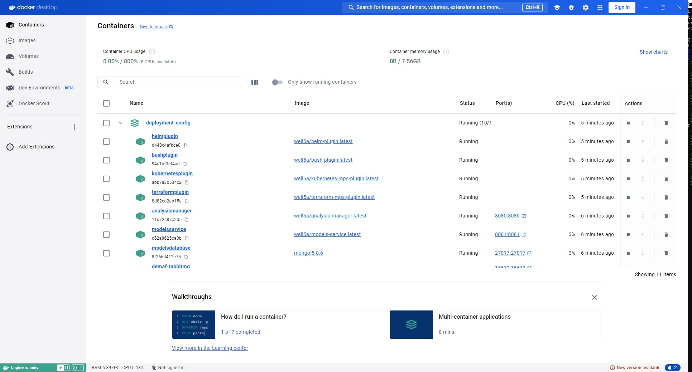
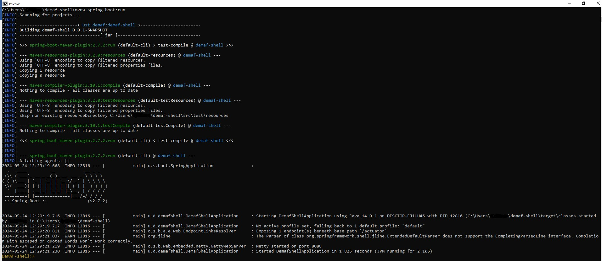
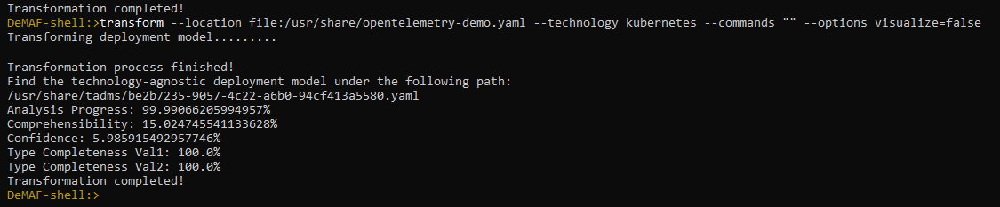
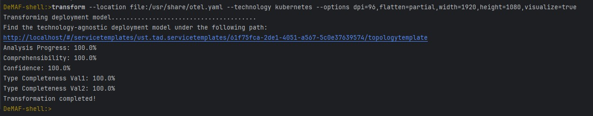
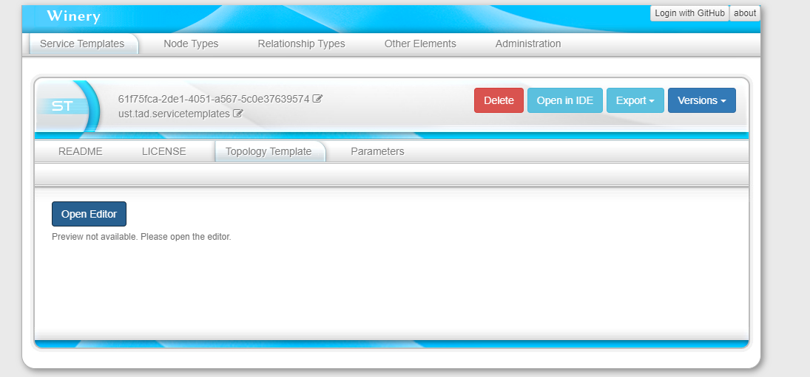
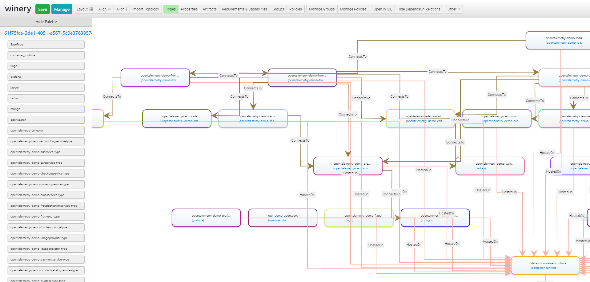

# Getting Started

The DeMAF supports the transformation of deployment models (files created with Kubernetes, Terraform, Ansible, etc.) into an abstract representation based on the Essential Deployment Metamodel (EDMM).

This guide helps you to deploy the DeMAF on your local machine and gives some usage examples.

## Prerequisites

To deploy the DeMAF Tool with `docker-compose`, it is required to install both *Docker* and *Docker Compose* (<https://docs.docker.com/compose/install/>). Depending on your OS, install *Docker Desktop*, as described on the website.

## Deployment

1. Clone the Deployment Config repository (<https://github.com/UST-DeMAF/deployment-config.git>)
    - `git clone https://github.com/UST-DeMAF/deployment-config.git`

2. In the docker-compose.yaml you may comment out certain plugins if you don't need them to save some resources. The default is to start the DeMAF with all available plugins.

3. Make sure the Docker Desktop application is running (or `dockerd` if you are running docker without it).

4. Go to the root directory of the `deployment-config` repository on your system and run `docker-compose pull && docker-compose up -d` on your system.
    - The console output looks like this:
      

    - Inside the docker-application you also see, that the containers are running:
      

## Usage with the WebUI

By default, the Docker Compose file will start the WebUI Service for user interaction.
We provide a [detailed guide on how to use the DeMAF with the WebUI service](<https://ust-demaf.github.io/web-ui/>).

## Usage with the CLI

As an alternative to the WebUI, you can use a command line interface provided by the DeMAF Shell.
We recommend commenting out the WebUI service in the Docker Compose file before deploying the DeMAF if you don't want to use it.
The DeMAF shell must the be deployed seperatily:

1. Clone the DeMAF-Shell repository to your system (as a independent repository, i.e. outside the `deployment-config` repository):
    - `git clone https://github.com/UST-DeMAF/demaf-shell.git`

2. Open a terminal and navigate to the `demaf-shell` root folder and run the command:
    - Windows: `mvnw spring-boot:run`
    - Mac and Linux: `./mvnw spring-boot:run`

    - The DeMAF-shell boots up:
      

3. Inside the DeMAF-shell you can run the following commands:
    - `transform`: transforms a deployment model into an EDMM Model
      - **arguments**:
        - `--location` (short: `-l`): location of the deployment model
            - The location argument is mandatory for the transformation process.
            - It needs to point to the volume folder of your cloned deployment-config repository (E.g. file:/usr/share).
            - After the location argument you need to specify that you search for a file. Use file: for this.
        - `--technology` (short: `-t`): deployment technology used (depends on available plugins `[bash, terraform, ...]`)
            - The technology argument is mandatory for the transformation process.
        - `--commands` (short: `-c`): specify how the deployment model is executed (e.g., for Terraform, you can pass parameters for the execution plan)
            - The commands argument is optional and not mandatory for the transformation process.
        - `--options` (short: `-o`):  the optionsargument is currently used for the visualisation service.
            - Flags which can be provided in the options argument:
              - `visualize=true/false` (default: `false`)
              - `height=pixel` (default: `1080` (pixels))
              - `width=pixel` (default: `1920` (pixels))
              - `flatten=true/false/partial` (default: `false`)
              - `dpi=dots` per inch of your monitor (default: `96` (dpi))
            - Example: `--options dpi=96,flatten=true,width=1920,height=1080,visualize=true`
            - The options argument is optional and not mandatory for the transformation process.
            - Don't use spaces between multiple options flags.
    - `plugins`: List all (available) registered plugins
    - `purge`: you can purge all plugin queues, which removes open or pending transformations (example: `purge 1` (removes the first queue of the list), `purge terraformSTATIC` (purges the terraform Queue)).
    - `listq`: Lists all available RabbitMQ queues (Queues of the plugins which can be purged) and the number of messages inside each queue
    - `help`: Shows all available commands for the Demaf-Shell

### Example I: Simple Transformation

- We provide example deployment models for various deployment technologies in the [opentelemetry-demo repository](https://github.com/UST-DeMAF/opentelemetry-demo/tree/main).
- For this example, we will use the Kubernetes deployment model. Download the [yaml-file](https://github.com/UST-DeMAF/opentelemetry-demo/blob/main/kubernetes/opentelemetry-demo.yaml) and store it in the volume folder of your deployment-config repository.
- Start the DeMAF Application as well as the DeMAF Shell, as explained in Step 1-6 of the Deployment section.
- Inside the DeMAF-Shell, run the following command:

```transform --location file:/usr/share/opentelemetry-demo.yaml --technology kubernetes --options visualize=false```

- Expected Result: 
- The result file can be found in the project folder `/deployment-config/volume/tadms`

### Example II: Visualization Service

- This example shows how to use the visualization service after the transformation process.
- For this example we will use the Kubernetes yaml-file. Download the [yaml-file](https://github.com/UST-DeMAF/opentelemetry-demo/blob/main/kubernetes/opentelemetry-demo.yaml) and store it in the volume folder of your deployment-config repository.
- Start the DeMAF Application as well as the DeMAF Shell, explained in Step 1-6.
- Run inside the DeMAF-Shell:

```transform -l file:/usr/share/opentelemetry-demo.yaml -t kubernetes -o dpi=96,flatten=true,width=1920,height=1080,visualize=true```

Expected Results:

- When using visualize=true the DeMAF Shell outputs a link to the Visualization in Winery: 
- Copy this link in a browser (or click on it if the hosting shell supports it) and you will see Winery: 
- Click on *Open Editor* and the graph will be visible: 

### Example III: Deployment Model using several Technologies

- Clone the Example Deployment Model: `git clone https://github.com/Well5a/kube`
- Run: ```transform --location file:/usr/share/kube/azure-start.sh --technology bash --commands ./azure-start.sh``` inside the DeMAF-shell

---

## Help Section

If you encounter problems during installation and initial use, the following points may help you:

1. If you try to run `docker pull && docker-compose up -d` command and you receive the following error:

  ```log
  C:\Users\USER\deployment-config>docker-compose pull && docker-compose up -d time="2024-05-24T12:12:57+02:00" level=warning msg="C:\\Users\\USER\\deployment-config\\docker-compose.yml: `version` is obsolete" unable to get image 'well5a/kubernetes-mps-plugin:latest': error during connect: this error may indicate that the docker daemon is not running: Get "http://%2F%2F.%2Fpipe%2Fdocker_engine/v1.45/images/well5a/kubernetes-mps-plugin:latest/json": open //./pipe/docker_engine: The system cannot find the specified file
  ```

- **Make sure the Docker-Application is running**
