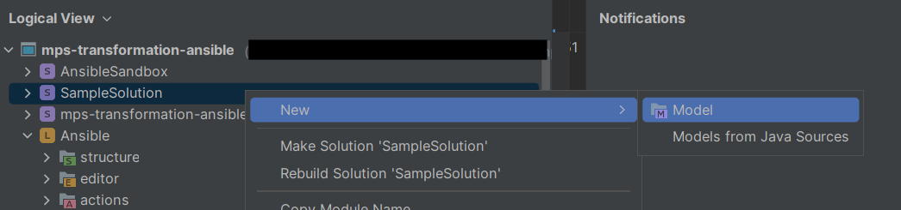
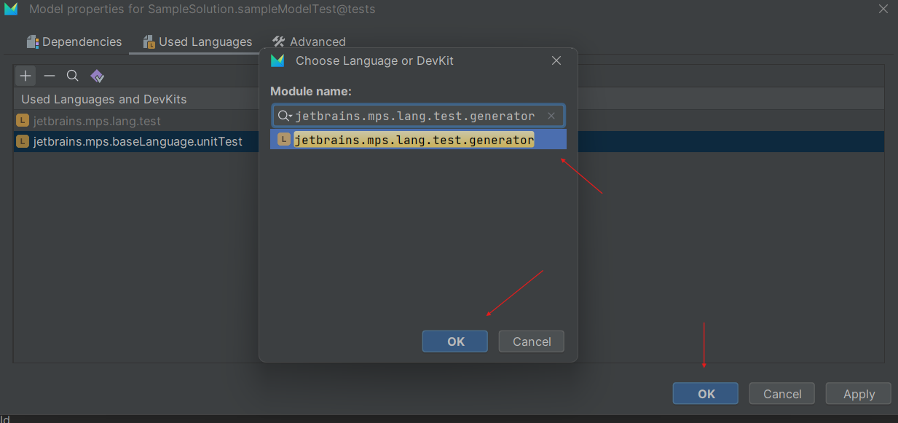
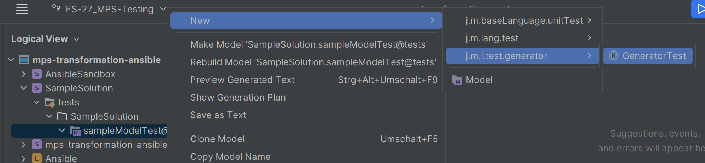
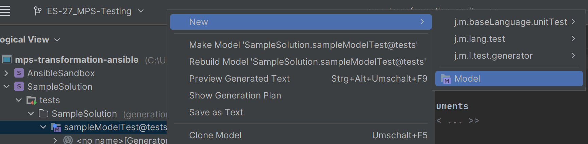
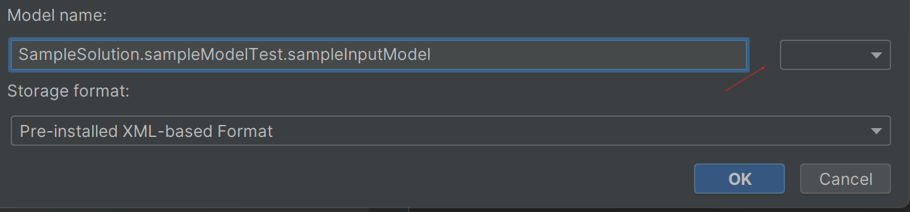
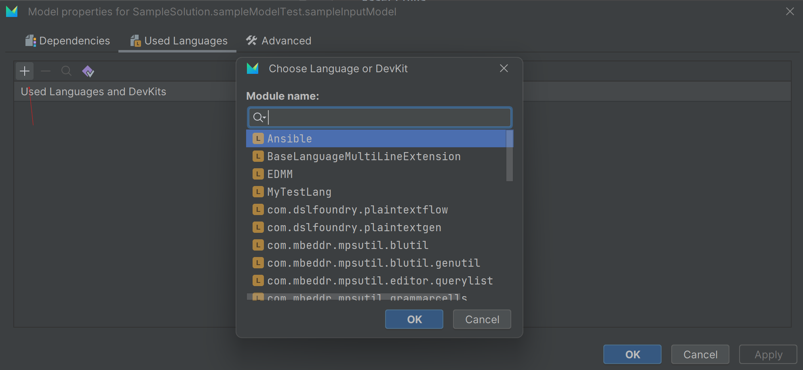
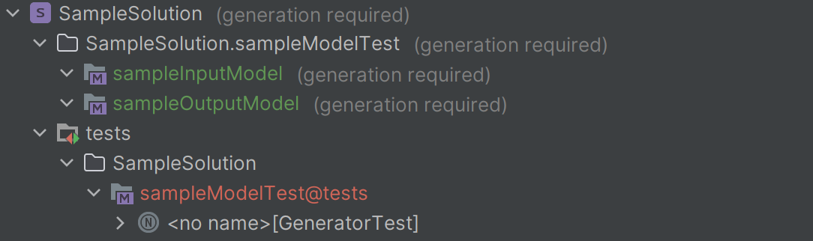
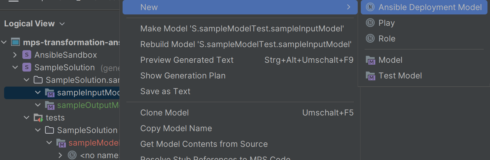
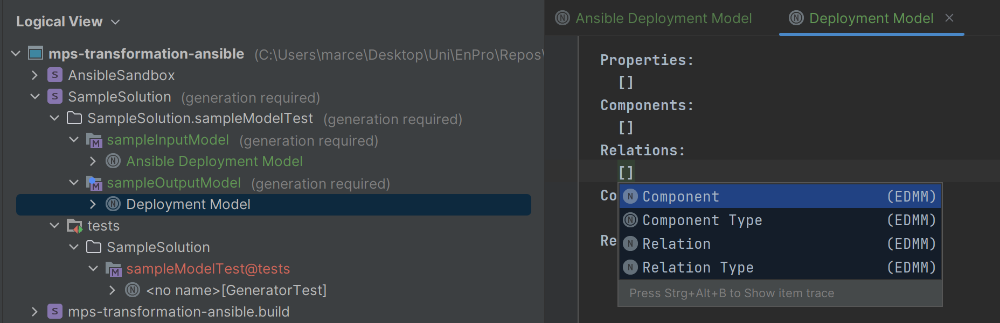
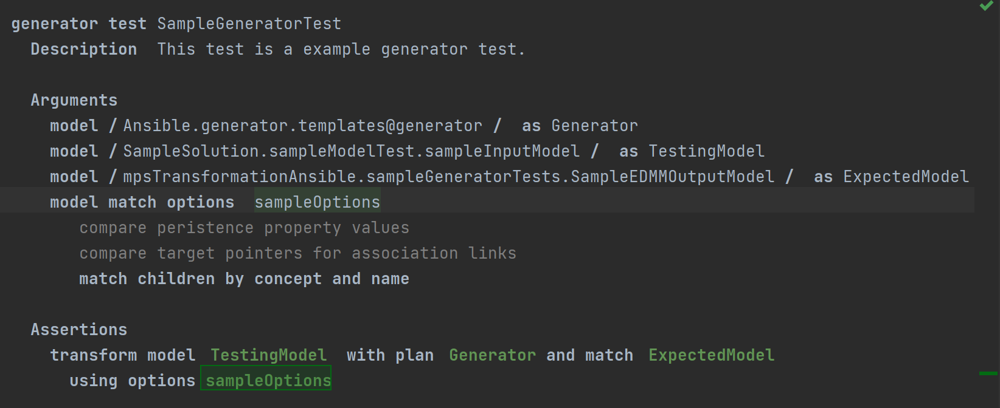

# MPS Generator testing:

This is a small guide for testing the MPS model translation with generator tests, more details can be found on [this link](https://www.jetbrains.com/help/mps/testing-languages.html#testscreation).

1. Create a new Model in a fitting Solution using by right-click.

2. Enter a proper name and make sure to **select** "@tests"

3. Import the language "jetbrains.mps.lang.test.generator" and finish the test model creation.

4. Now you can start creating generator tests, by right-click on the test model.

5. After creating the generator test you need to create the input model you want to test.

6. Enter a proper name and make sure to **un**select the "@test".

7. Add the language of the input model and finish the model creation. Do the same creation for the expacted output model.

8. Finally you should have these modules:

---
## Creating tests

To create tests you need to create specific input and output models:

1. Right-click on the models and create a new deployment model for each.

2. Now add the features you want to test and define the expected output. Use the keys **ctrl + space** in the deployment models to add components.

3. After adjusting these models, write the test in the generator test file. Use **ctrl + space** to see the possible testing options.

4. Now you can run the test by using **right-click**.

